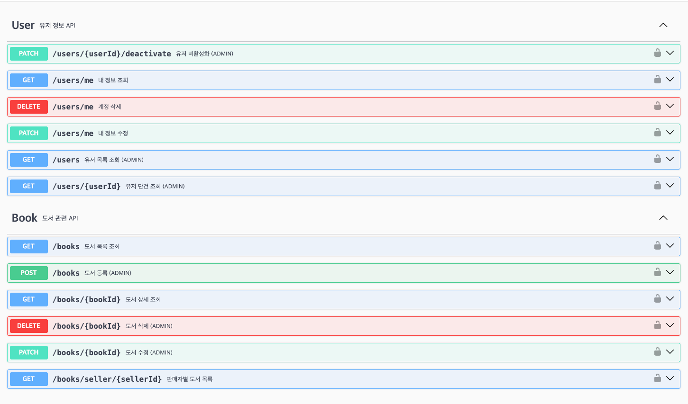

# Bookstore API

Spring Boot 기반 온라인 서점 백엔드입니다. JWT 인증/인가, 도서·장바구니·주문·리뷰·댓글·위시리스트 등을 제공합니다.

## 배포 정보
- Base URL: [http://113.198.66.68:10188](http://113.198.66.68:10188)
- Swagger: [http://113.198.66.68:10188/swagger-ui/index.html](http://113.198.66.68:10188/swagger-ui/index.html)
- Health: [http://113.198.66.68:10188/health](http://113.198.66.68:10188/health)

## 응답 규격
- 성공
```json
{
  "status": "success",
  "message": "요청이 성공했습니다.",
  "statusCode": "200",
  "data": {}
}
```
- 실패
```json
{
  "status": "error",
  "message": "에러 메시지",
  "statusCode": "400"
}
```

## RESTful 엔드포인트 요약
**Auth (/auth)**  
- POST `/auth/signup` : 회원가입(이메일 검증, 비밀번호 암호화, 중복 검사)  
- POST `/auth/login` : 로그인, JWT 발급  
- POST `/auth/refresh` : 토큰 재발급  
- POST `/auth/logout` : 로그아웃  
- PUT `/auth/profile` : (현재 `/users/me`에서 처리) 프로필/비밀번호 수정  

**Users (/users)**  
- GET `/users/me` / PATCH `/users/me` / DELETE `/users/me`  
- GET `/users` (ADMIN)  
- GET `/users/{id}` (ADMIN)  
- PATCH `/users/{id}/deactivate` (ADMIN)  

**Books (/books)**  
- POST `/books` (ADMIN)  
- GET `/books` : 페이지네이션 기본 size=20, 정렬 기본 createdAt DESC, 필터(keyword, publisher, minPrice, maxPrice, dateFrom/To)  
- GET `/books/{id}`  
- PATCH `/books/{id}` (ADMIN)  
- DELETE `/books/{id}` (ADMIN)  

**Cart (/cart)**  
- GET `/cart`  
- PUT `/cart/items` (수량 0이면 삭제)  
- DELETE `/cart/items/{cartItemId}`  
- DELETE `/cart/clear`  

**Orders (/orders)**  
- POST `/orders`  
- GET `/orders/{orderId}`  

**Wishlist (/wishlist)**  
- POST `/wishlist`  
- GET `/wishlist`  
- DELETE `/wishlist/{bookId}`  

**Reviews (/reviews)**  
- POST `/reviews`  
- PATCH `/reviews/{reviewId}`  
- DELETE `/reviews/{reviewId}`  
- POST `/reviews/{reviewId}/like`  
- DELETE `/reviews/{reviewId}/like`  

**Comments (/comments)**  
- POST `/reviews/{reviewId}/comments`  
- PATCH `/comments/{commentId}`  
- DELETE `/comments/{commentId}`  
- POST `/comments/{commentId}/like`  
- DELETE `/comments/{commentId}/like`  

**기타**  
- GET `/ranking` : 찜 수 기준 상위 도서  
- GET `/statistics/books/{bookId}` : 도서 통계(샘플)  
- GET `/discounts` , `/discounts/{id}` : 할인 정보(샘플)  
- GET `/settlements/sellers/{sellerId}` : 정산 정보(샘플)  

### Swagger UI 캡처:
  - 
  - 

## 실행 방법
**요구사항**: JDK 25, MySQL 8.x  

**환경 변수 예시**  
```
DB_HOST=113.198.66.68
DB_PORT=3306
DB_NAME=bookstore
DB_USERNAME=<mysql-사용자>
DB_PASSWORD=<mysql-비밀번호>
JWT_SECRET=<긴 비밀키>
```

## 빌드 및 서버 배포 준비
```
./gradlew clean bootJar -x test 

scp -i jjy.pem -P 19188 \
  build/libs/bookstore-0.0.1-SNAPSHOT.jar \
  ubuntu@113.198.66.68:/home/ubuntu
```

## JCloud 서버 준비
Ubuntu 기준 설치 커맨드입니다. 이미 설치되어 있다면 건너뛰세요.
- Java 25 (OpenJDK):  
  ```bash
  sudo apt update
  sudo apt install -y openjdk-25-jdk
  java -version
  ```
- MySQL 8.x:  
  ```bash
  sudo apt install -y mysql-server
  sudo systemctl enable --now mysql
  sudo mysql_secure_installation
  ```
- Node/npm & PM2 (무중단 구동):  
  ```bash
  sudo apt install -y nodejs npm
  sudo npm install -g pm2
  pm2 --version
  ```
- PM2 실행 예시(서버에서):  
  ```bash
  pm2 start ecosystem.config.js
  pm2 save
  pm2 startup    # 재부팅 후 자동 시작 등록
  ```

## PM2 ecosystem.config.js 예시
```js
module.exports = {
  apps: [
    {
      name: "bookstore",
      cwd: "/home/ubuntu",
      script: "java",
      args: "-jar bookstore-0.0.1-SNAPSHOT.jar --spring.profiles.active=prod",
      instances: 1,
      autorestart: true,
      watch: false,
      max_memory_restart: "512M",
      env: {
        DB_HOST: "localhost",
        DB_PORT: "3306",
        DB_NAME: "example",
        DB_USERNAME: "example",
        DB_PASSWORD: "example",
        JWT_SECRET: "example"
      }
    }
  ]
}
자세한 값은 .env에서 확인 가능
```

## 추가 자료
- API 설계서(PDF): `docs/API-design.pdf`
- DB 설계서(PDF): `docs/DB-docs.pdf`

```
